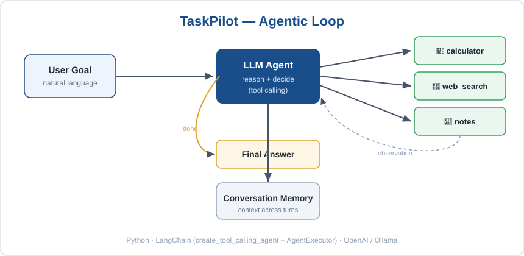

# TaskPilot

A small AI agent I built to understand how "agentic AI" and tool calling actually
work. Instead of just chatting, it decides which tool to use, runs it, looks at the
result, and keeps going until the task is done - and it prints each step so you can
watch it reason.

Built with Python and LangChain. Runs on the OpenAI API or a local model via Ollama.


## Tools it has

- `calculator` - safe arithmetic (no eval, so no code injection)
- `web_search` - live results from DuckDuckGo
- `save_note` / `list_notes` - simple memory saved to a local notes.json

It also keeps chat history, so it remembers context across turns.

Note: an agent can only do what its tools let it do. Adding a new ability just means
adding a new tool - that's the whole idea.

## How a turn works



## Example

```
You: What is 18% of 2,450, and save the result as a note.

> calculator("2450 * 0.18")  ->  441.0
> save_note("18% of 2450 = 441")  ->  Saved. You now have 1 note(s).

TaskPilot: 18% of 2,450 is 441. I saved that as a note.
```

## Setup

```bash
git clone https://github.com/kirubakaran-7/taskpilot-agent.git
cd taskpilot-agent
python -m venv .venv
.venv\Scripts\activate            # mac/linux: source .venv/bin/activate
pip install -r requirements.txt
cp .env.example .env
python main.py
```

For OpenAI, set `BACKEND=openai` and `OPENAI_API_KEY` in `.env`.
For a free local run, set `BACKEND=ollama`, install [Ollama](https://ollama.com) and
`ollama pull llama3.1` (use a model that supports tool calling).

## Files

- `main.py` - the terminal chat loop
- `agent/core.py` - builds the agent (LLM + tools + prompt)
- `agent/tools.py` - the tools
- `agent/calc.py` - the safe calculator (this is what the tests cover)

## Tests

```bash
pip install pytest
pytest -q
```

## What I learned

- How tool calling lets the model pick actions on its own
- Why a calculator tool is safer and more reliable than letting the LLM do math
- How to keep chat history so the agent has context

## Ideas for later

- Add a Wikipedia tool
- Give it longer-term memory
- Wrap it in a Streamlit UI

## License

MIT
